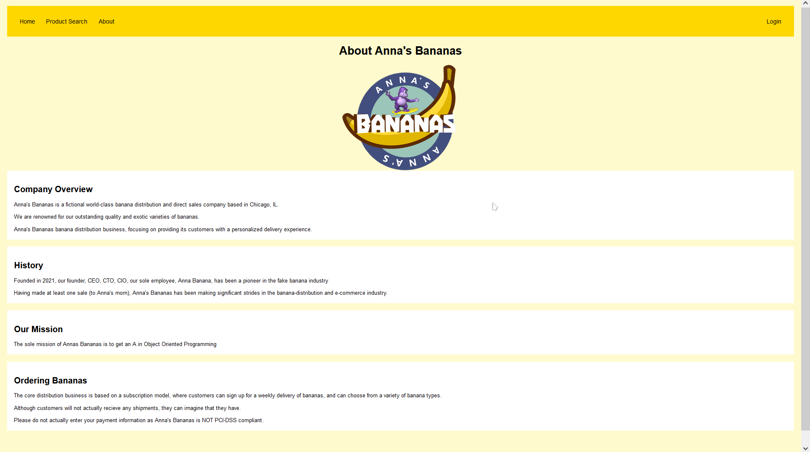
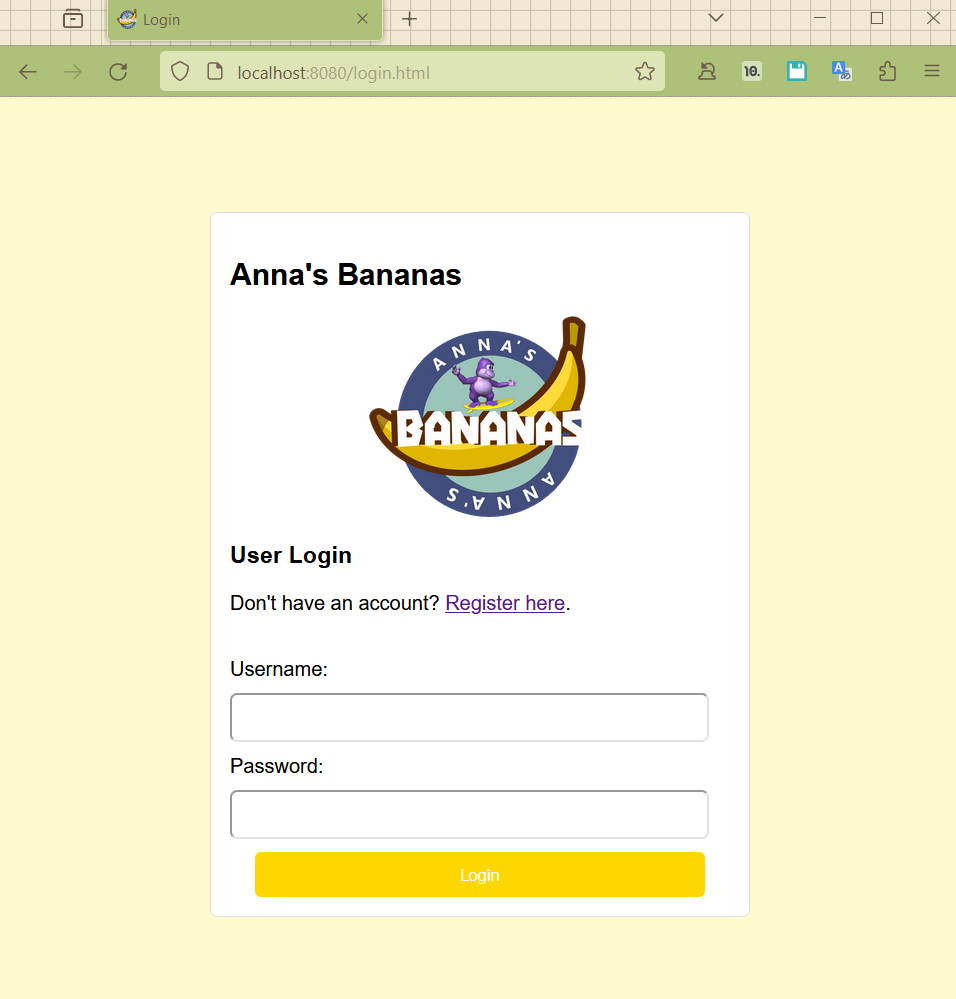
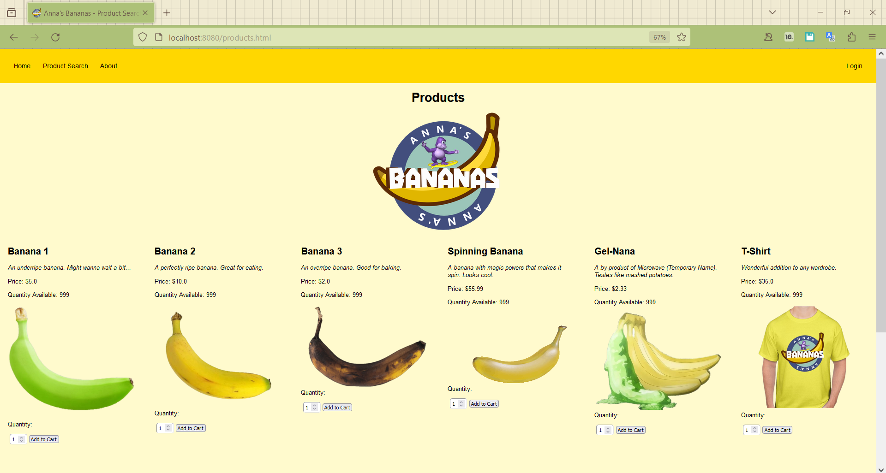
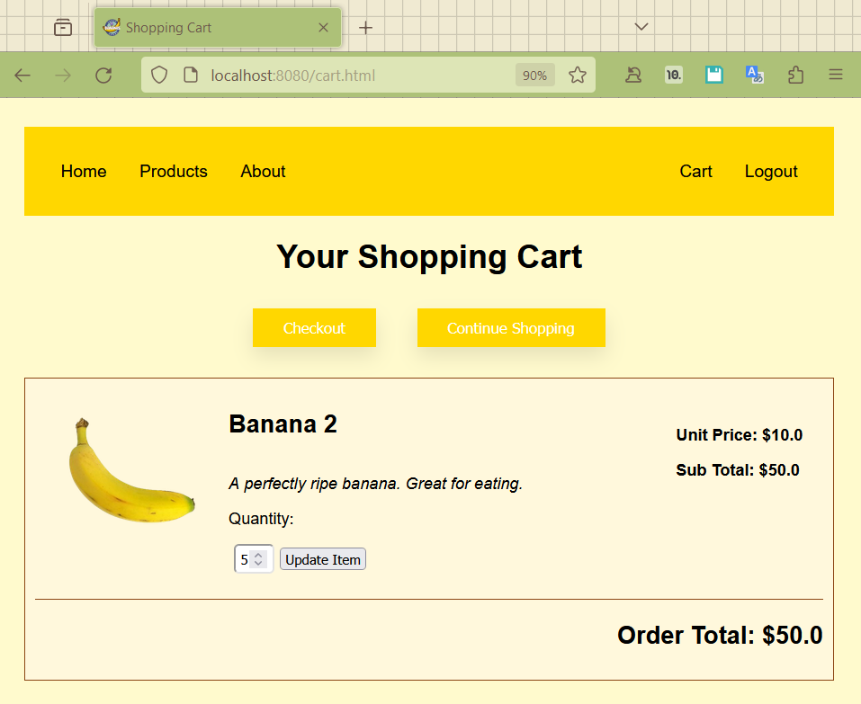
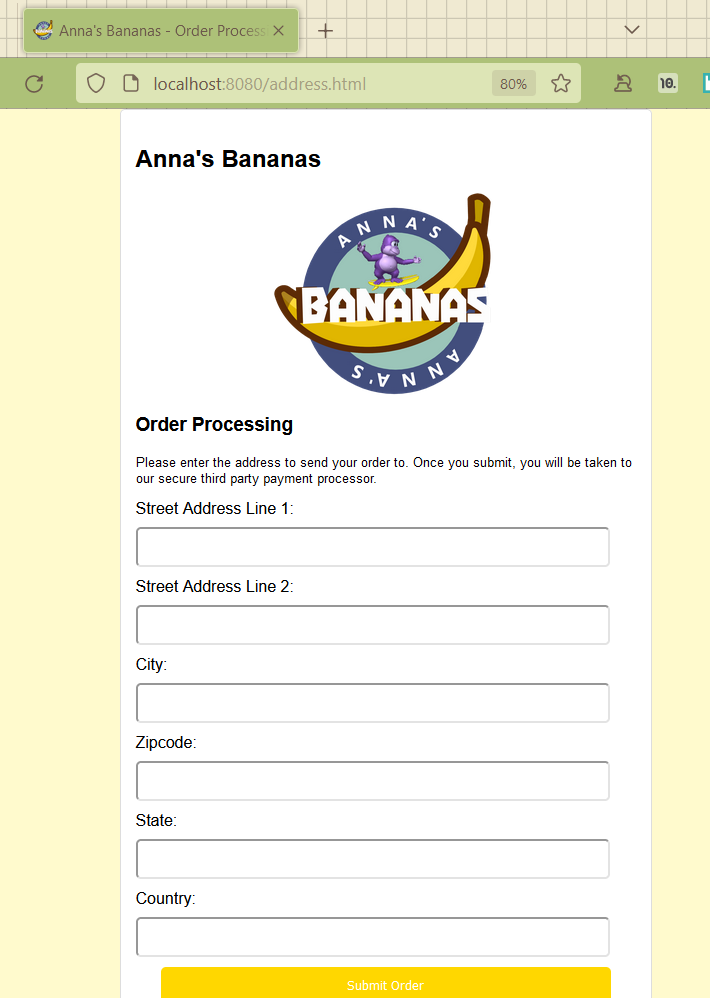
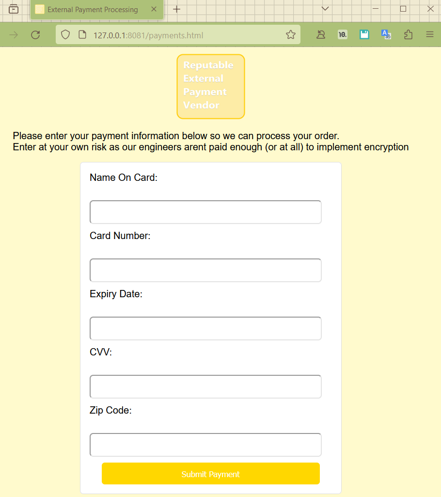
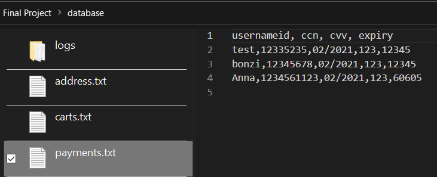
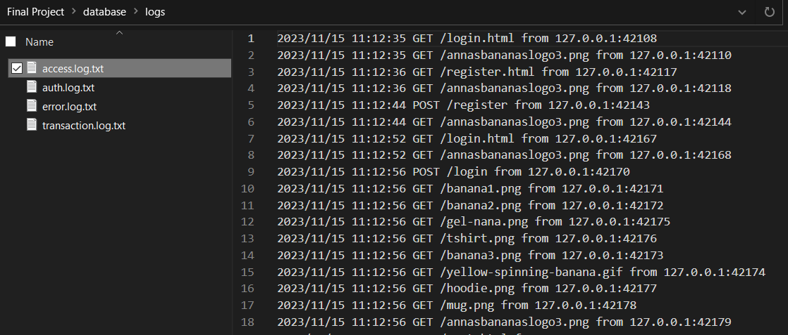

# Anna's Bananas eCommerce Site
## SE 450 Final Project
### Anna Andler | 11/15/2023

# Site HTML Pages
## Homepage
The below is the landing page when a user first navigates to the server.
From here, you can use the navigation bar to go to other tabs in the server

{width=50 height=50}

## About
The about page is an explaination of the company's origin and mission. 

{width=50 height=50}

## Login
Users can login to their existing account to access their cart and place orders. From here, a new user can follow the link to make a new account

{width=50 height=75}

## Register
A new user can create an account here. From here, they will be able to sign in.

{width=50 height=75}

## Products
The products page contains all of the products available for purchase. The products are dynamically displayed from the backend server. A signed-in user can add products to their cart.

{width=100 height=50}

## Cart
Once signed in, a user can add items to their cart and they will be displayed here. Once an item is added, they can "checkout" and place an order.

{width=75 height=75}

## Address
Once the checkout process has begun, a user will be prompted to enter the address to send the order to. Following this page, they will be redirected to the payment server to process their order payment.

{width=50 height=75}

## Payments
The payment server (accessible only on TCP 8081) is just a payment submission form that is "processed" and saved. 

{width=50 height=75}

## Success!
Once a user has been registered or an order has been placed, a thank you page is displayed.

{width=75 height=75}

# Site Database Backend
## Address Database
Address database - stores user addresses. Processed after checkout submit

{width=100 height=50}

## Cart Database
Cart database - stores user carts. Can be modified via products page by adding an item to the cart, or by changing the quantity in the cart page. Status is changed from false to true once the cart is checkedout

{width=100 height=50}

## Payments Database
Payments Database - stores user payment information. Edited and Accessed only by the Payment Server. Completely unencrypted and a severe PCI-DSS violation. Good thing this is a fake company. 

{width=100 height=50}

## Products Database
Products Database - stores product information. Manually edited and updated depending on site inventory. 

{width=100 height=50}

## Users Database
Users Database - stores user login information. Updated upon user registration.

{width=100 height=50}

# Site Logging Functionality
## Access Log
Access logs are saved for each resource a client accesses. The request type and request path are saved along with a timestamp and source IP/port.

{width=100 height=50}

## Auth Log
Authentication logs are saved for each login attempt. The username and wheter or not the attempt was successful is stored along with a timestamp and source IP/port.

{width=100 height=50}

## Transaction Log
All components of a checkout transaction are logged. This includes the checkout attempt, address submission, and payment processing. The transaction type, result, source and timestamp are saved. 

{width=100 height=50}

## Error Log
Any server error is stored in errors.log. I did not encounter any errors during my final testing, so I could not provide a sample output. 

